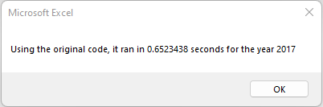
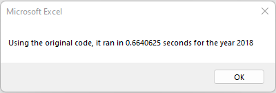
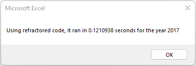
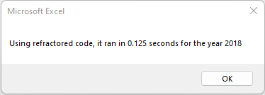
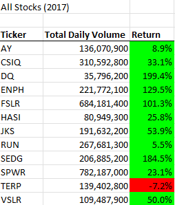
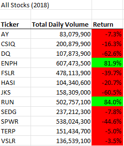

Refactor VBA code and measure performance

Purpose of Analysis

The purpose of this analysis was to refractor the VBA code origianlly created to analyze the performance of the list of stocks for 2017 and 2018, and to determine if the refractored code improves the performance and runs the analysis faster.

Below are screenshots required for this assignement:

How to Perform the Analysis

The original procedure analyzed 3,012 lines of stock data for 12 stocks during each of the years 2017 and 2018. Each stock has a ticker code consisting of two, three or four letters. Stock data for each year was in tables with tabs named 2017 and 2018, respectively. For each stock in each of the two years, the total volume was summed up over the full year. 

The price at the end of the year was subtracted from the price at the start of the year to determine the rate of return. Data for total volume and annual return for each stock was presented in a formatted table. Stocks showing a positive annual return were highlighted in green and stocks that lost value over the year were highlighted in red.

Summary

For the original procedure, the program went through the ordered list in the table for the representative year (2017 or 2018) until the stock ticker name changed. When that occurred, the total volume and rate of return for that stock was recorded in the next line of the All Stocks Analysis table. The program then went back to either the 2017 or 2018 to continue the analysis for the next stock ticker. This process continued until the program reached the final line of the 2017 or 2018 data table.

In the refracted procedure, the program started at the top of either the 2017 or 2018 table and remained in that table until the program processed all of the data. Data for each stock was recorded in respective arrays. These arrays included tickers, tickerVolumes, tickerStartingPrices, and tickerEndingPrices. When the program reached the end of the data table, data from the respective arrays was presented in the All Stocks Analysis table and formatted as in the same manner as in the original procedure. 

Conclusions

When programmers write code to solve a problem, the first iteration may be simple and easy to write, will work well and will produce the correct output, but it may have problems. Such problems may be that the code may run slowly or inefficiently, or the program may not be user-friendly. Over time, bugs may appear as the program is operated over different scenarios. A common example is a program that works without a problem during an ordinary year (365 days), but in a leap year with an extra day (Feb. 29), failure of the programmers to incorporate the extra day into the code may cause errors or the program to crash. 

Refractoring code can help identify and remove bugs and enable programs to operate in most, if not all, conceivable scenarios. Refractoring code can enable programs to run more quickly and efficiently. This is an important consideration when data sets get larger. A data set with approximately 3,000 lines is relatively small and even very inefficient code will process a small data set quickly (under one second), but as the number of lines of data get larger, then such coding inefficiencies will lead to interminable delays. 

In this specific example, the original code was inefficent because it had to keep switching between either the 2017 and 2018 data table and the All Stocks Analysis worksheet at least 12 times during the entire run of the program. The refractored VBA script started at the top of either the 2017 or 2018 data table until it reached the end, recording data for each stock in respective arrays. Upon completion of all calculations, it then switched to the All Stocks Analysis to present and format the final data. 

Thus, in the refractored code there was only one switch between the data table worksheet and the All Stocks Analysis worksheet. The original code switched worksheets every time the stock ticker name changed in the data table worksheet which in this analysis involved 12 stock ticker names.

Times to run the original VBA script was approximately 0.658 seconds on average for both years 2017 and 2018. In contrast, the refractored code ran the same procedures with an average time of approximately 0.123 seconds, less than 20% of the time required by the original VBA script. Such a significant increase in processing speed and inefficiency is very important when handling large datasets which are common in real datasets used by businesses, institutions, and organizations.  
